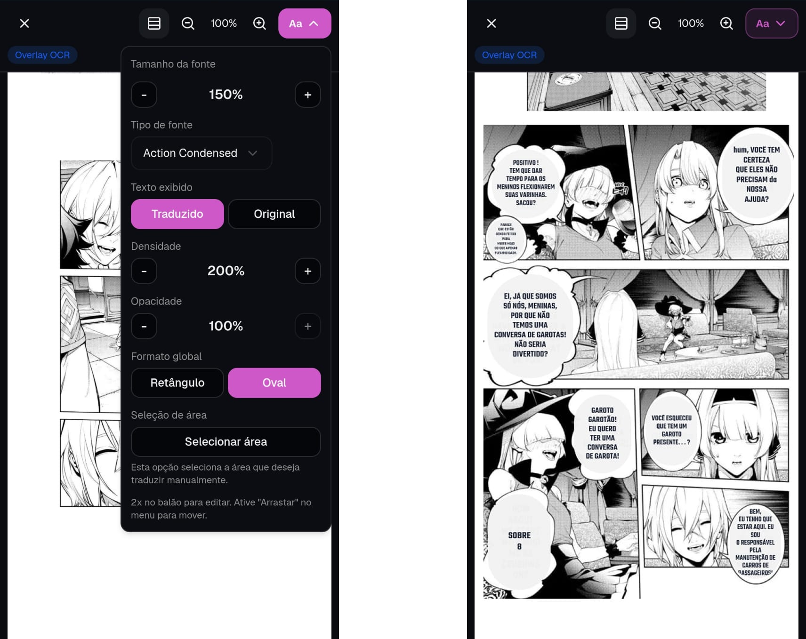
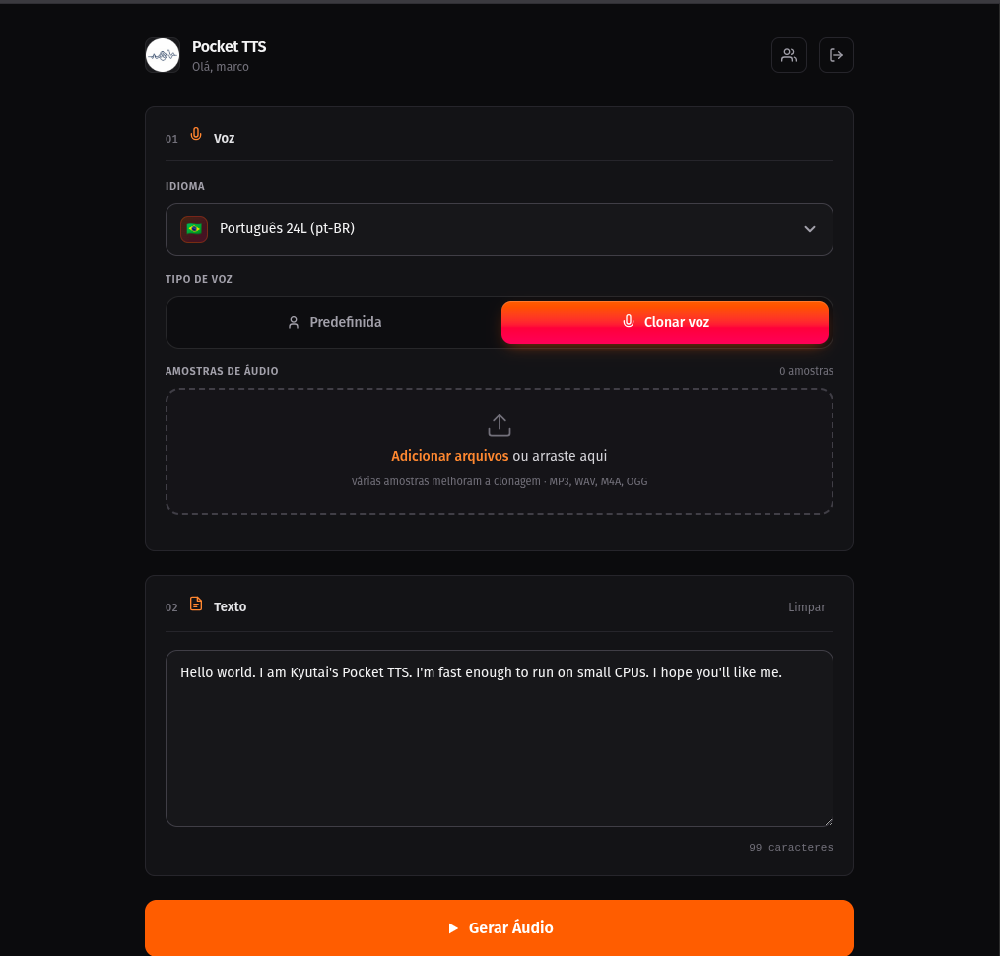
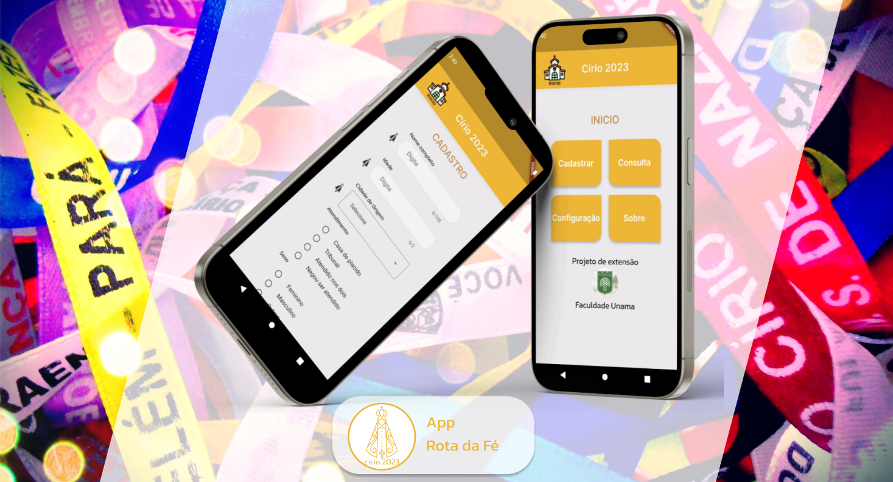
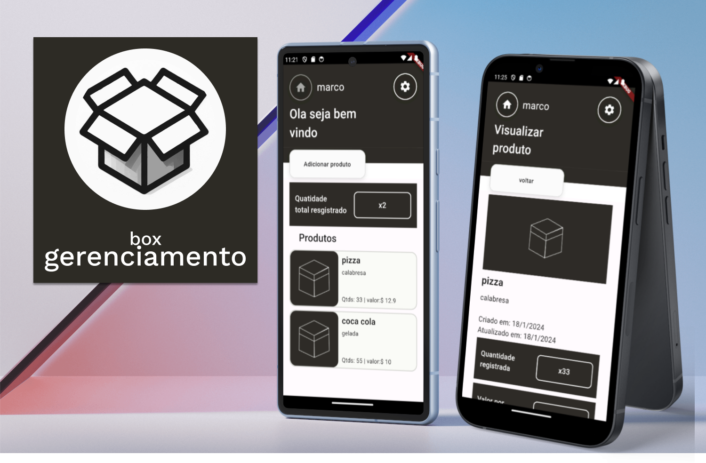
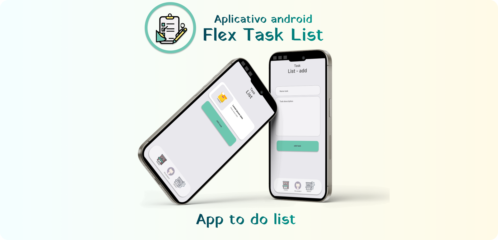

  

  <h1>👋 Olá, eu sou Marco Antonio 🎯</h1>

  

    
  

  

    
    
  

  

    <a href="#-sobre-mim"><b>Sobre Mim</b></a> •
    <a href="#-projetos-principais-e-recentes"><b>🚀 Projetos</b></a> •
    <a href="#-aplicativos-mobile"><b>📱 Mobile</b></a> •
    <a href="#-projetos-web--utilitários"><b>🌐 Web & Tools</b></a> •
    <a href="#%EF%B8%8F-tecnologias--ferramentas"><b>🛠️ Tech Stack</b></a> •
    <a href="#-estatísticas-do-github"><b>📊 Estatísticas</b></a>
  

---

## 👨‍💻 Sobre Mim

<table>
  <tr>
    <td width="58%" valign="top">
      <h3>👋 Prazer, eu sou Marco Antonio!</h3>
      
Desenvolvedor de Software com <b>25 anos</b>, especializado na criação de produtos digitais robustos, interfaces responsivas e arquiteturas escaláveis para <b>Web & Mobile</b>.

      <ul>
        <li>🎓 <b>Formação:</b> Bacharelado em Ciência da Computação</li>
        <li>📍 <b>Localização:</b> Brasil 🇧🇷</li>
        <li>🟢 <b>Status:</b> Disponível para novos projetos e soluções inovadoras</li>
        <li>⚡ <b>Foco:</b> Next.js, NestJS, Flutter, Integrações de APIs e Inteligência Artificial</li>
      </ul>
      
Tenho facilidade em transformar ideias complexas em softwares funcionais, intuitivos e com foco na experiência do usuário (UI/UX).

    </td>
    <td width="42%" align="center" valign="middle">
      
    </td>
  </tr>
</table>

  <table>
    <tr>
      <td align="center" width="33%">
        <b>🌐 Web Full Stack</b> 
        Next.js • TypeScript • NestJS • Tailwind
      </td>
      <td align="center" width="33%">
        <b>📱 Mobile Multiplataforma</b> 
        Flutter • Dart • SQLite • REST APIs
      </td>
      <td align="center" width="33%">
        <b>🤖 IA & Engenharia de APIs</b> 
        Python • OpenCV • Voice Cloning • Docker
      </td>
    </tr>
  </table>

---

## 📊 Estatísticas do GitHub

  
  

---

## 🚀 Projetos Principais e Recentes

### [📱 MangAIO Translate – App Tradutor de Mangá Gratuito para Android](https://mangaiotranslate.agevon.com/)
> **App tradutor de mangá gratuito para Android com processamento inteligente de texto e imagem.**

  

- 🔗 **Acesse o site oficial:** [mangaiotranslate.agevon.com](https://mangaiotranslate.agevon.com/)

---

### [🌐 Translate Manga BR – Tradutor de Mangá para Web Self-Hosted](https://github.com/marco0antonio0/translate-manga-br)
> **Solução self-hosted para tradução automatizada de mangás e quadrinhos via web.**

  

- 🔗 **Repositório:** [github.com/marco0antonio0/translate-manga-br](https://github.com/marco0antonio0/translate-manga-br)

---

### 🎙️ Ferramenta de Clonagem de Voz Desktop 🔒
> **Software de clonagem de voz offline de alta performance otimizado para execução exclusiva em CPU.**

   

- 🔒 **Projeto Privado**
- Viabiliza a clonagem de áudio com naturalidade no desktop sem a necessidade de placas de vídeo (GPU), sendo totalmente acessível para computadores modestos.

---

### [🦴🎮 OsteoplayVet - Gamificação de Anatomia Veterinária](https://osteoplayvet.netlify.app/)
> **Plataforma interativa gamificada para o ensino e fixação de conteúdos de anatomia veterinária.**

  

- Integração dinâmica de dados com MakeAPI.
- 🔗 **Página do projeto:** [osteoplayvet.netlify.app](https://osteoplayvet.netlify.app/)

---

### [🧾 Gerador de Certificados Personalizados](https://github.com/marco0antonio0/gen_certificate)
> **Gerador e renderizador de certificados digitais em lote com automação de screenshots e exportação.**

 

- 🔗 **Repositório:** [gen_certificate](https://github.com/marco0antonio0/gen_certificate)

---

### [🚀 Metasnap – Gerador Automático de Thumbnails](https://github.com/marco0antonio0/gen_certificate/blob/main/README.md)
> **Automação web para captura e geração instantânea de prévias e thumbnails de páginas.**

 

- 🔗 **Repositório:** [gen_certificate/metasnap](https://github.com/marco0antonio0/gen_certificate/blob/main/README.md)

---

### [📊 UXtracking – Rastreamento de Interações do Usuário](https://uxtracking.liis.com.br/)
> **Ecossistema de análise comportamental de UX com extensão para navegador e painel analítico com IA.**

    

- Integração com IA especializada UXtracking-AI e API Gateway.
- 🔗 **Acesse o painel:** [uxtracking.liis.com.br](https://uxtracking.liis.com.br/)
- 🔗 **Extensão no Chrome Web Store:** [UX Tracking Extension](https://chromewebstore.google.com/detail/ux-tracking-extension/haigigcinnnjomeimdknnbindagalica?hl=pt-BR&utm_source=ext_sidebar)

---

### [🚀 RespondeAI – Correção Inteligente de Gabaritos](https://github.com/marco0antonio0/RespondeAI-front)
> **Correção automatizada de provas e gabaritos através de visão computacional (OpenCV) e IA.**

  

- 🔗 **Repositório:** [RespondeAI-front](https://github.com/marco0antonio0/RespondeAI-front)

---

### [🚀 DirrochaCMS – Gestor de Conteúdo e Gerador de APIs](https://github.com/marco0antonio0/DirrochaCMS)
> **Headless CMS para criação e gerenciamento dinâmico de endpoints e conteúdos com agilidade.**

   

- 🔗 **Repositório:** [DirrochaCMS](https://github.com/marco0antonio0/DirrochaCMS)

---

### [🛒 Dirrocha E-commerce (Full Stack)](https://github.com/marco0antonio0/E-commerce_front-end)
> **Solução completa de loja virtual com front-end reativo em Flutter Web e back-end em NestJS.**

| Front-end (Flutter Web) | Back-end (NestJS & Swagger) |
| :---: | :---: |
|  |  |
| [🔗 Repositório Front-end](https://github.com/marco0antonio0/E-commerce_front-end) | [🔗 Repositório Back-end](https://github.com/marco0antonio0/E-commerce_back-end) |

- **Recursos:** Conexão com múltiplos fornecedores, carrinho dinâmico, autenticação e documentação completa via Swagger.

---

## 📱 Aplicativos Mobile

### [📱 Aplicativo CadMED 2024](https://github.com/CAD-MED/Projeto-de-extensao-CAD-MED)
> Aplicativo voltado para cadastro e acompanhamento médico comunitário.

https://github.com/user-attachments/assets/9c3137f4-91e0-467d-aa21-91b4be816ff7

  

- Sincronização em nuvem e persistência offline.
- [Repositório GitHub](https://github.com/CAD-MED/Projeto-de-extensao-CAD-MED) • [Download do APK](https://github.com/CAD-MED/Projeto-de-extensao-CAD-MED/releases)

---

### [📱 Aplicativo Rota da Fé - Círio (2023 & 2024)](https://github.com/RotaDaFe/trabalho_extensao_projeto_cirio_2024)
> Guia interativo e suporte aos romeiros e devotos do Círio de Nazaré.

| Edição 2024 | Edição 2023 |
| :---: | :---: |
| https://github.com/user-attachments/assets/c4d43463-f5ab-4551-afde-74fc506cb6ba |  |
| [🔗 Repositório 2024](https://github.com/RotaDaFe/trabalho_extensao_projeto_cirio_2024) | [🔗 Repositório 2023](https://github.com/marco0antonio0/trabalho_extensao_projeto_cirio_2023) |

---

### [📱 Aplicativo Box Gerenciamento](https://github.com/marco0antonio0/app-box-gerenciamento) & [📱 Flex Task List](https://github.com/marco0antonio0/App-Task-List)

| Box Gerenciamento | Flex Task List |
| :---: | :---: |
|  |  |
| [🔗 Repositório](https://github.com/marco0antonio0/app-box-gerenciamento) • [Download APK](https://github.com/marco0antonio0/app-box-gerenciamento/releases) | [🔗 Repositório](https://github.com/marco0antonio0/App-Task-List) • [Download APK](https://github.com/marco0antonio0/App-Task-List/releases/tag/v1) |

---

## 🌐 Projetos Web & Utilitários

<b>📂 Clique para expandir a lista de outros projetos web</b>

 

| Projeto | Descrição | Preview / Links |
| :--- | :--- | :---: |
| **GENReadme.js** | Gerador dinâmico de documentação README.md com IA | [🌐 Site](https://genreadme.dirrocha.com/) • [💻 GitHub](https://github.com/marco0antonio0/GENReadme.js) |
| **Portfólio Pessoal** | Modelo de portfólio moderno para desenvolvedores | [💻 GitHub](https://github.com/marco0antonio0/Portfolio) |
| **Login Page Example** | Interface de autenticação moderna e responsiva | [🌐 Site](https://login-demo.dirrocha.com/) • [💻 GitHub](https://github.com/marco0antonio0/loginPageExample) |
| **Me Adote (MedVet)** | Plataforma para adoção de animais resgatados | [🌐 Site](https://adote.nova-work.cloud/) • [💻 GitHub](https://github.com/marco0antonio0/trabalho_extensao_medVet) |
| **Store Play Games** | Blog e vitrine de catálogo de jogos em Next.js | [🌐 Site](https://store-games.nova-work.cloud/) • [💻 GitHub](https://github.com/marco0antonio0/blog-games-nextjs) |
| **Calculadora de Notas** | Utilitário para cálculo e simulação de notas acadêmicas | [🌐 Site](https://calculadora-notas.nova-work.cloud/) • [💻 GitHub](https://github.com/marco0antonio0/calculadora-notas-faculdade) |
| **Gerador README Flutter**| Aplicação Flutter Web para templates rápidos de README | [🌐 Site](https://facilities-readme.nova-work.cloud/#/) • [💻 GitHub](https://github.com/marco0antonio0/Gerador-README-Flutter) |
| **Topers Cursos** | Landing page moderna para venda de cursos online | [🌐 Site](https://topercursos.nova-work.cloud/) • [💻 GitHub](https://github.com/marco0antonio0/Site-topers-cursos) |
| **Pokédex Project** | Consumo interativo de PokéAPI com Next.js & Tailwind | [🌐 Site](https://pokedex.nova-work.cloud/) • [💻 API](https://github.com/marco0antonio0/api-pokemons) |

---

## 📈 Estudos em Andamento

- 🚧 **Projetos em desenvolvimento ativo:**
  - 🍳 **Blog Cozinharte:** Next.js & Oracle Database Integration
  - 🚗 **Clone Uber Alternativo:** Arquitetura reativa em Flutter
  - 💳 **App Frente de Caixa (PDV):** Solução mobile em Flutter
  - 🖨️ **Calculadora de Impressão 3D:** Utilitário mobile em Flutter

---

## 🛠️ Tecnologias & Ferramentas

### 💻 Linguagens & Frameworks

  

### 🗄️ Bancos de Dados & DevOps

  

### 🚀 Deploy & Ferramentas

  

---

  
⭐ Desenvolvido por <b>Marco Antonio</b>

